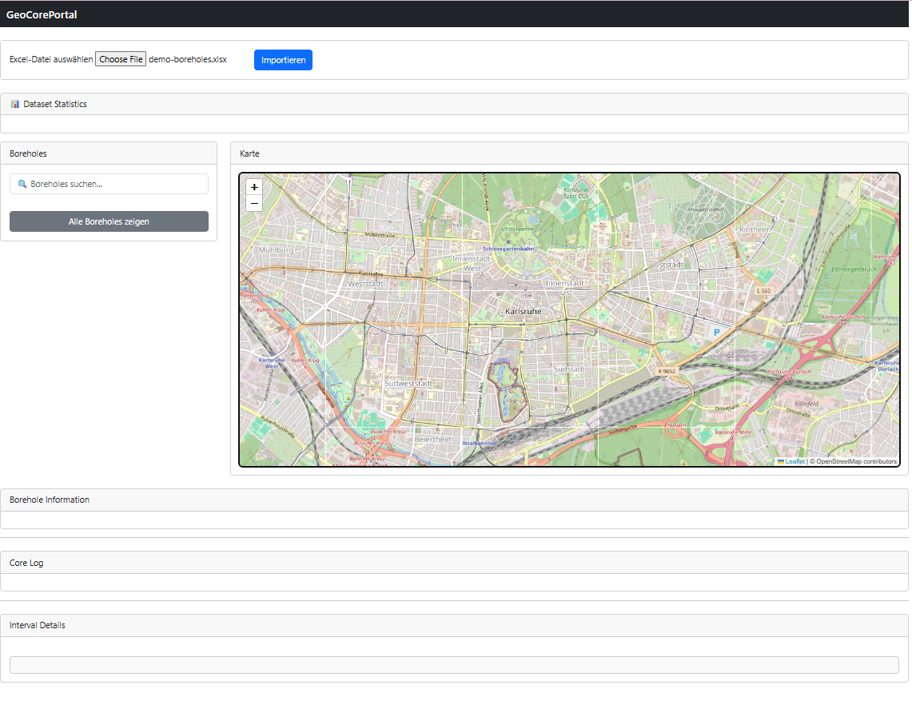
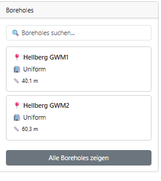
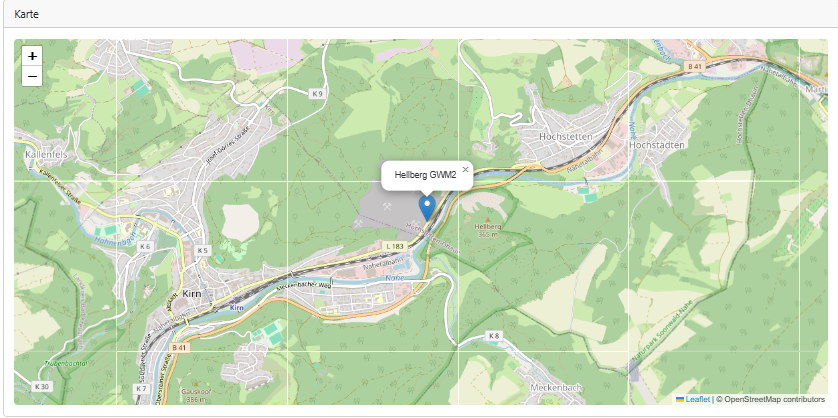
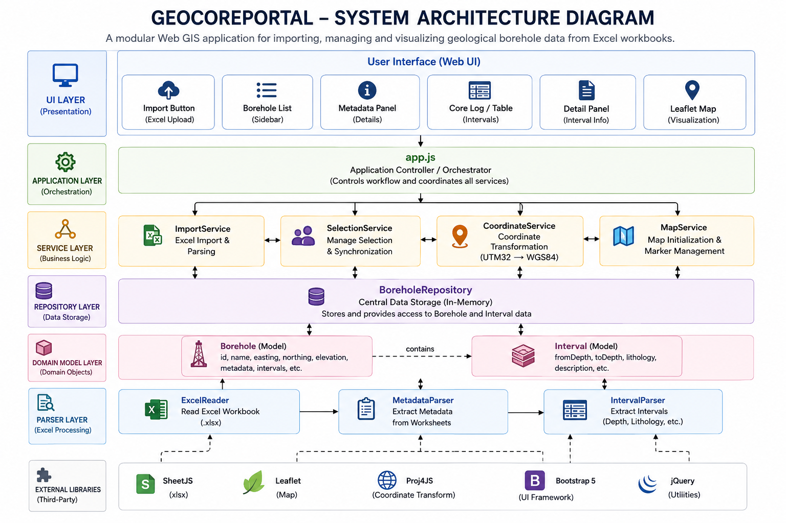
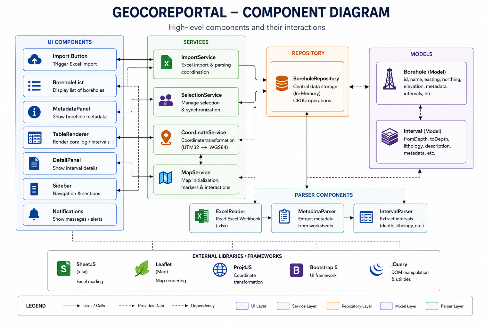
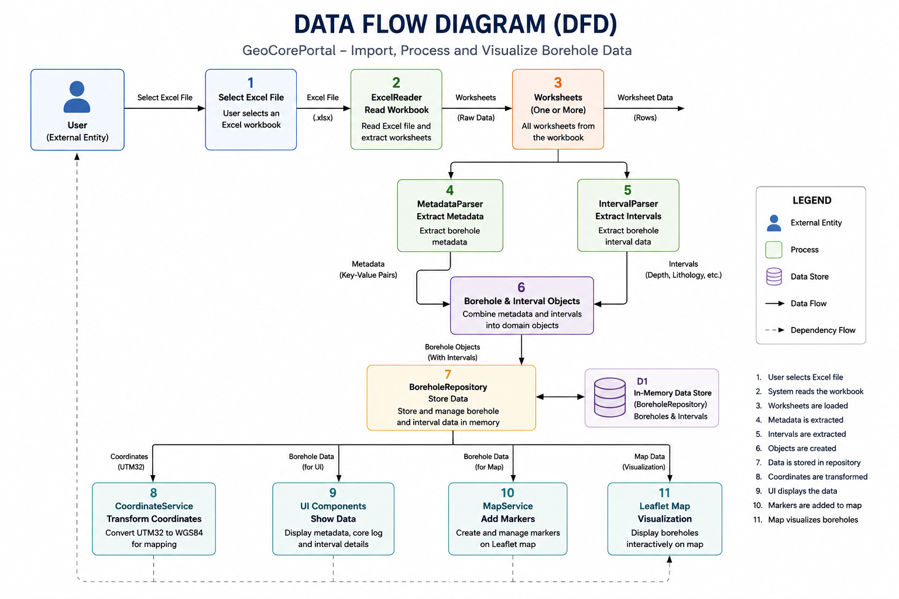
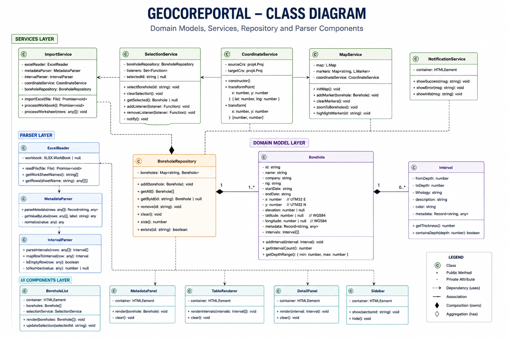
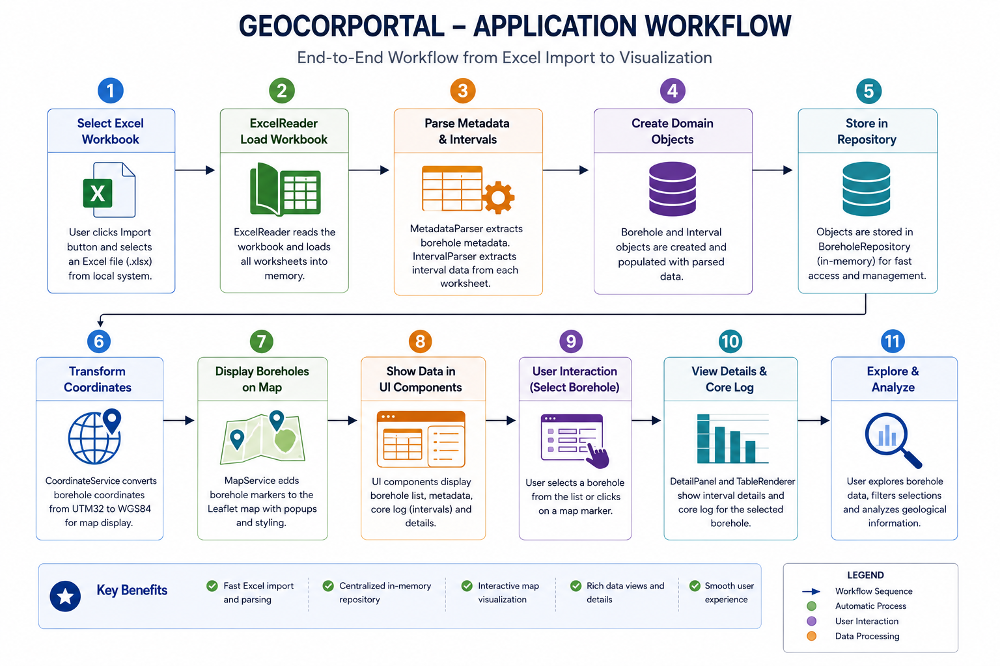
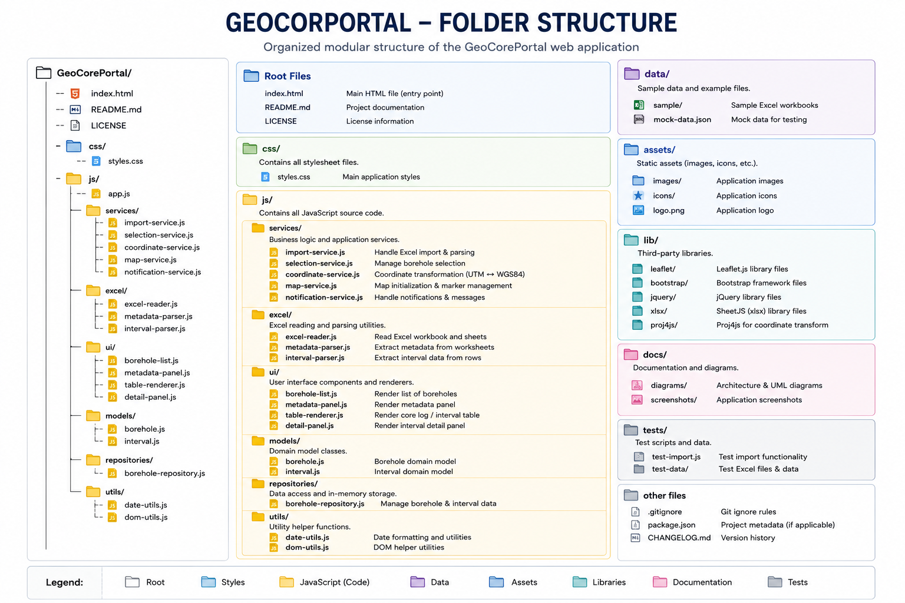

# GeoCorePortal

A modular Web GIS application for importing, managing and visualizing geological borehole data from Excel workbooks.


A modular JavaScript Web GIS application demonstrating Excel data processing, coordinate transformation and interactive geological visualization.

## Overview

GeoCorePortal is a modular Web GIS application for importing, managing and visualizing geological borehole data stored in Microsoft Excel workbooks.

The project demonstrates how traditional Excel-based geological workflows can be transformed into an interactive Web GIS application using modern JavaScript software architecture and geospatial technologies.

The application automatically imports one or multiple worksheets, extracts borehole metadata and geological intervals, converts projected UTM32 coordinates into WGS84 geographic coordinates and visualizes boreholes on an interactive Leaflet map.

The project follows modern software engineering principles including modular architecture, Repository Pattern, Service Layer, reusable UI components and domain models to provide a scalable and maintainable application.

## Table of Contents

- [Overview](#overview)
- [Project Objectives](#project-objectives)
- [Screenshots](#screenshots)
- [Features](#features)
- [Design Principles](#design-principles)
- [Software Architecture](#software-architecture)
- [Folder Structure](#folder-structure)
- [Technologies](#technologies)
- [Installation](#installation)
- [Usage](#usage)
- [Workflow](#workflow)
- [Current Status](#current-status)
- [Roadmap](#roadmap)
- [Version History](#version-history)
- [Author](#author)
- [License](#license)

## Project Objectives

The project was developed to demonstrate:

- Modular JavaScript application design
- GIS application development
- Geological data management
- Excel data processing
- Coordinate transformation
- Interactive mapping
- Clean software architecture

## Screenshots

### Main Application



### Borehole Selection



### Interactive Map



## Features

### Excel Processing

- Import Excel (.xlsx) files
- Multi-sheet workbook support
- Automatic metadata extraction
- Interval parsing

### GIS

- Coordinate conversion (UTM32 → WGS84)
- Interactive Leaflet map
- Automatic zoom to imported boreholes
- Marker visualization

### User Interface

- Responsive Bootstrap interface
- Interactive borehole selection
- Metadata panel
- Core log viewer
- Interval details

## Design Principles

GeoCorePortal was developed following modern software engineering practices:

- Repository Pattern
- Service Layer Pattern
- Domain Models
- Single Responsibility Principle (SRP)
- Separation of Concerns
- Modular UI Components
- Reusable Services

## Software Architecture

### System Architecture



### Component Diagram



### Data Flow



### Class Diagram



### Workflow



## Folder Structure



## Technologies

| Technology     | Purpose               |
| -------------- | --------------------- |
| JavaScript ES6 | Application Logic     |
| Bootstrap 5    | User Interface        |
| Leaflet        | Interactive Map       |
| Proj4JS        | Coordinate Conversion |
| SheetJS (xlsx) | Excel Import          |
| HTML5          | Frontend              |
| CSS3           | Styling               |

## Installation

Clone the repository

```bash
git clone https://github.com/yourusername/GeoCorePortal.git
```

Open the project in Visual Studio Code.

Install the Live Server extension (if not already installed).

Right-click index.html and select Open with Live Server.

The application will be available at:

```
http://127.0.0.1:5500

```

## Usage

1. Open the application.
2. Select an Excel workbook.
3. Click **Importieren**.
4. Browse imported boreholes.
5. Select a borehole.
6. View metadata.
7. Inspect geological intervals.
8. Explore borehole locations on the map.

## Workflow

1. Select an Excel workbook.
2. Import all worksheets.
3. Parse metadata.
4. Parse borehole intervals.
5. Store boreholes in the repository.
6. Convert coordinates.
7. Display boreholes on the map.
8. Select a borehole from the list.
9. View metadata and interval details.

## Current Status

Version **1.0.0** is the first stable prototype.

### Implemented modules

- [x] Excel Import
- [x] Multi-sheet Support
- [x] Metadata Parser
- [x] Interval Parser
- [x] Coordinate Transformation
- [x] Leaflet Map
- [x] Marker Management
- [x] Repository Pattern
- [x] Selection Service
- [x] Responsive Bootstrap UI

## Roadmap

### Version 1.1

- Borehole Search
- Borehole Filtering
- Marker Clustering

### Version 1.2

- PostgreSQL/PostGIS Integration
- GeoServer Support
- WMS/WFS Layers

### Version 2.0

- User Authentication
- Project Management
- Cloud Deployment

## Version History

```md
### v1.0.0

Initial prototype release featuring:

- Excel workbook import
- Multi-sheet workbook support
- Geological metadata extraction
- Core log parsing
- Coordinate transformation (UTM32 → WGS84)
- Interactive Leaflet map
- Borehole repository
- Borehole selection
```

## Author

**Shaikh Shahidul Islam**

GIS Software Developer

📍 Germany

GitHub: [sumon05](https://github.com/sumon05)

## License

This project is licensed under the MIT License.

See the LICENSE file for details.

## Acknowledgements

Special thanks to the open-source community for the following libraries:

- Leaflet
- SheetJS
- Proj4JS
- Bootstrap
- OpenStreetMap

```

```

```

```
